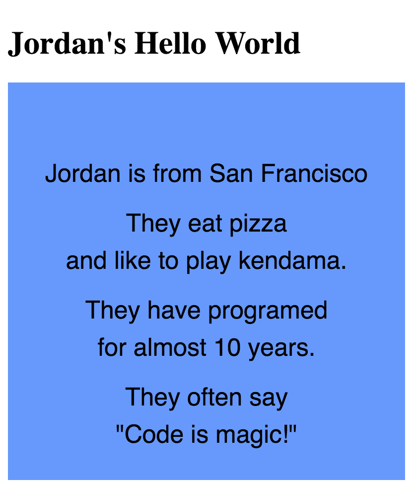
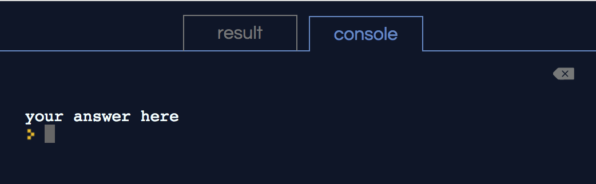

## Welcome to Ramp!

We are excited to have you in the program and we look forward to helping you strengthen your programming skills.

## Ramp Links

- Program Guide: [make.sc/ramp-program-guide](make.sc/ramp-program-guide)

This document contains more detail about the Ramp program and what to expect.

- Office Hours Calendar: [make.sc/ramp-office-hours](make.sc/ramp-office-hours)

View the upcoming scheduled office hours.

- Slack: [make.sc/ramp-slack](make.sc/ramp-slack)

Join Slack to meet your peers and get and give more online help from the instructor, TAs, and your peers.

- Repl.it Classroom: [make.sc/ramp-start](make.sc/ramp-start)

This is where you'll work on and submit your code for each assignment.

This first section is designed to quickly get you familiar with the course structure and how to get the most out of it.

# Assignment Formatting

As you read through the assignments here, you'll see different kinds of formats for drawing your attention to key areas.

### Learning

Along the way, important information will be highlighted in an...

> [info]
> information box

### Doing

Any time you need to add some code or complete an important step, you'll find it in an...

> [action]
> action box

### Checking

After you've come up with your own answer, you can expand the...

> [solution]
> solution box

### Growing

Along the way and at the end of the tutorial, you can push yourself by tackling all of the...

> [challenge]
> bonus challenges in boxes like this

# Watching Videos

Each assignment in Ramp 0 start with a selection of videos from [The Coding Train's p5.js Tutorial Playlist](https://www.youtube.com/watch?list=PLRqwX-V7Uu6Zy51Q-x9tMWIv9cueOFTFA&v=8j0UDiN7my4). Please watch all of the videos to best prepare for completing the code challenges for that assignment.

The code challenges are designed to allow you to practice and extend your understanding of the concepts covered in the videos. Often, the solution to a code challenge relies upon using the same exact coding technique from one of the videos with a few small changes. (Students who choose to tackle the code challenges without watching the videos first often waste time working on solutions that are more complicated than they need to be.)

## Video Guides

> [info]
> Note: You can find Video Guides for all tutorial videos in the Projects section of the classroom
>

# Completing Assignments

All assignments must be completed and submitted through the Repl.it classroom - check out [make.sc/ramp-quick](make.sc/ramp-quick) for a quick overview.

> [action]
> Visit [make.sc/ramp-start](make.sc/ramp-start) to join the classroom.
>

Each assignment is set up like a web page, that can use HTML, CSS, and Javascript.

> [action]
> Navigate to the first assignment, `0.0 Hello World`.
>

In the code window, you should see several tabs along the top that you can switch between:

```
index.html // web page
sketch.js  // JS file where you will complete challenges
helpers.js // JS file with helper code you should not change
```

All of the assignments in Ramp 0 use `p5.js`, which is a Javascript library (extra features packaged together for convenience), so the majority of your code will be added to `sketch.js`.

> [info]
> In some assignments there will be code in a `helper.js` fil that helps make the program more beginner friendly but that you don't need to interact with directly. Feel free to look at the contents, but please **do not** make edits there.
>

## Code Challenges

Complete all of the challenges in each assignment. Be sure to **read the directions carefully** and check that both your code and the end result meet all of the requirements as given.

Once you are finished with an assignment you can submit it using the buttons in the upper right corner.

The instructor will then review your submission and mark the assignment as completed or send it back to you with feedback for changes if it's not quite working yet.

> [info]
> There is no need to wait for feedback before moving on to the next assignment if you feel ready.
>

# Getting Stuck and Getting Help

What if you are stuck? You have a few options for getting help.

## Post on Slack

If you've joined the Slack community, you can post a question in `#level_0_help` - just be sure to review the guidelines for how to ask for help without sharing too much of your code!

[make.sc/ramp-slack](make.sc/ramp-slack)

## Submit with a Comment

For trickier bugs or questions it can often be best to submit your code so that the instructor can view your full project.

Include details about what you are stuck on in a comment at the top of `sketch.js` and submit the assignment.

An instructor will then review your submission, give feedback, and return your submission so you can complete it.

## Attend Office Hours

Office hours are on a drop-in basis, no need to schedule in advance. Join the meeting by visiting [make.sc/ramp-meeting](make.sc/ramp-meeting) (you will need to download Zoom the first time).

If none of the office hours fit your schedule and you need help, please send an email and we can make other arrangements.

## Other Questions

Email [ramp@makeschool.com](mailto:ramp@makeschool.com) for any other questions you have.

Good luck, and happy coding as you tackle your first code challenges below! :)

# Challenge 1: Add your name

> [info]
> If you haven't already, visit [make.sc/ramp-start](make.sc/ramp-start) to join the classroom, then navigate to the _0.0 Hello World_ assignment to start the challenges below.
>

**in `index.html`**

> [action]
> Find the `h1` tags in `index.html` and add your name so that it says `YOURNAME's Hello World`
>

# Challenge 2: Update the canvas color

**in `sketch.js`**

> [action]
> Locate `backgroundColor = color(100, 150, 255);` inside of `sketch.js` and change the 3 number values to create a custom color.

# Challenge 3: Fill in your info

**in `sketch.js`**

> [action]
> Find the `?` in `sketch.js` and replace them with your own answers.
>

Make sure your answers work with the text on the screen:



# Challenge 4: Answer a question using the print function

**in `sketch.js`**

Question: What inspired you to learn to code?

> [action]
> Type your answer inside of the `print()` function
>

View the console tab in the results panel to check your output:



# Bonus 1: Answer another question

**in `sketch.js`**

> [challenge]
> Add a new `print` statement and answer the question "What would you like to help create in the world?"
>

# Bonus 2: Fix the code formatting error

**in `sketch.js`**

> [challenge]
> Scan the left side of the code panel for the *i* indicator and hover over it to read the suggested fix. Then make the change.
>
