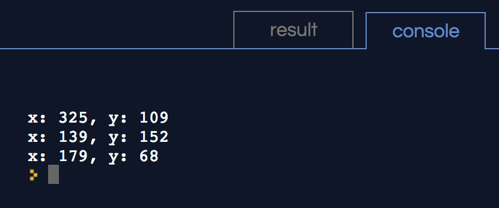
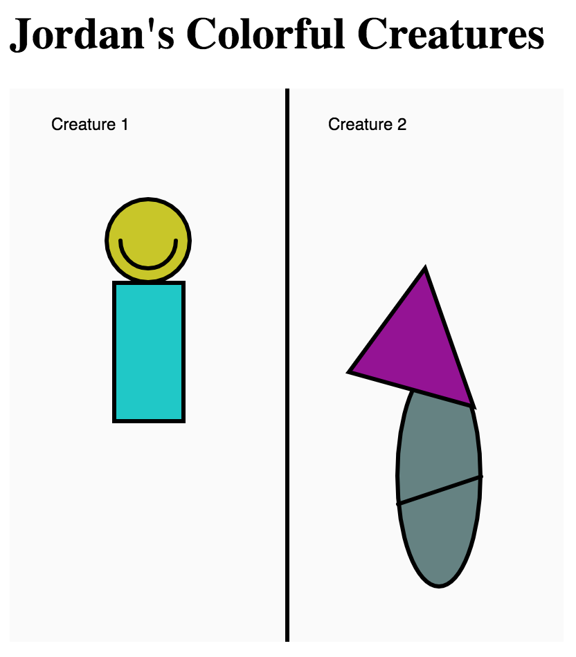

## Watch [Video 1.1 - Introduction](https://www.youtube.com/watch?v=8j0UDiN7my4)

# Watch [Video 1.3 - Basics of Drawing](https://www.youtube.com/watch?v=D1ELEeIs0j8)

# Watch [Video 1.4 - Color](https://www.youtube.com/watch?v=9mucjcrhFcM)

# Challenge 1: Add your name

**in `index.html`**

> [action]
> Find the `h1` tags in `index.html` and add your name so that it says `YOURNAME's Colorful Creatures`
>

# Challenge 2: Draw Creature 1 and Creature 2

**in `sketch.js`**

Create a creature by combining multiple shapes to create a more complex drawing.

> [info]
> Look up how to use new functions by viewing the **Shape** section in the [p5.js Reference](https://p5js.org/reference/)
>

As you are making your creatures you should notice that the location `0,0` is in the top left corner and `x` and `y` values get bigger as you move down and to the right.

> [info]
> For help getting exact x and y values for your shapes, click on the canvas, then look in the console to see the values for where you clicked.
>

> [action]
> create one creature on each side of the center line
>

<!--  -->

> [action]
> Use 4 or more different shape functions (`rect` , `line` , `ellipse` , `arc` , `triangle` , `quad` , etc)
>

<!--  -->

> [action]
> Use 4 or more different colors in `fill` and/or `stroke`
>

## Example

> [solution]
> 
>

# Bonus 1: Give your creatures names

**in `sketch.js`**

> [challenge]
> Add more code to display your creature names - do not change the existing text or modify the `helper.js` file.
>
