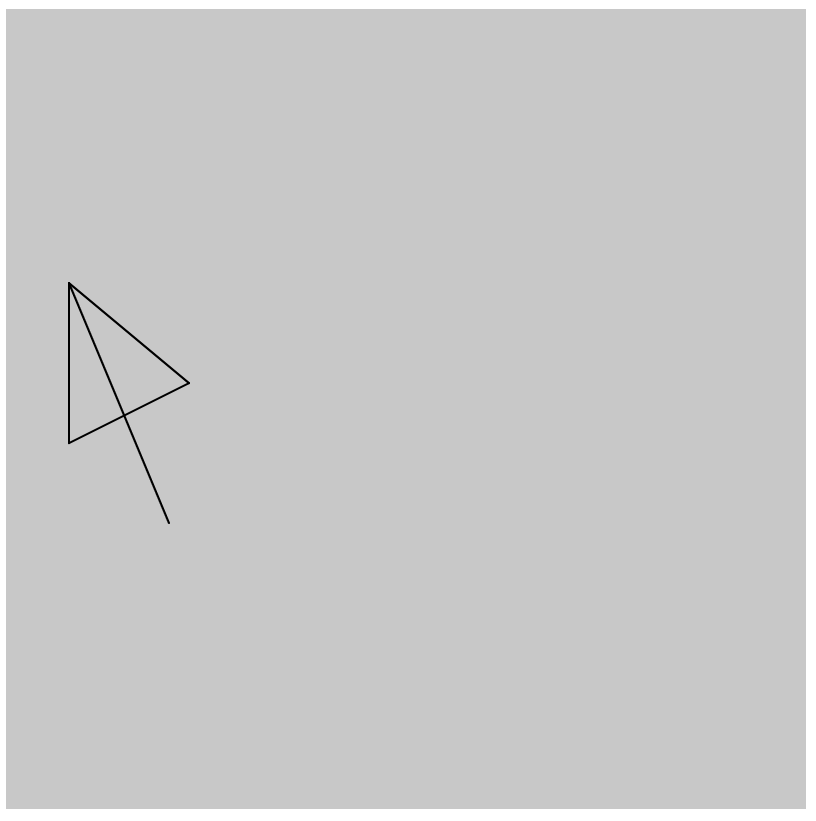
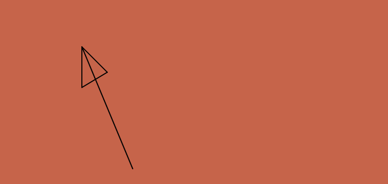
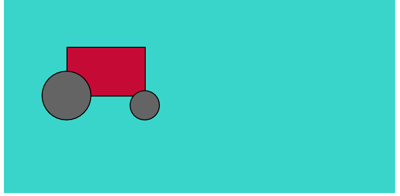
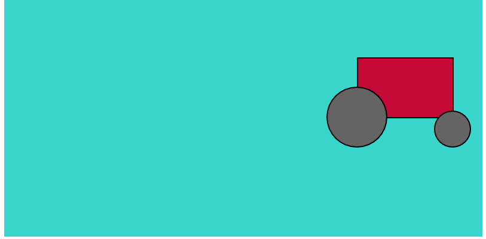

## Watch [Video 2.1 - Variables (mouseX, mouseY)](https://www.youtube.com/watch?v=RnS0YNuLfQQ)


# Watch [Video 2.2 - Variables (make your own)](https://www.youtube.com/watch?v=Bn_B3T_Vbxs)


# Challenge 1: Add your name

**in `index.html`**

> [action]
> Find the `h1` tags in `index.html` and add your name so that it says `YOURNAME's...`
>

# Challenge 2: Create a big arrow that follows the mouse

**in `sketch.js`**

> [action]
> Use `line` to add 3 more lines to create the triangle top of the arrow
>

Arrow size and shape should be the same no matter where you move the mouse. Customize the color and line size to your liking.

## Example

> [solution]
> 
>

# Challenge 3: Create a variable for the background color

**in `sketch.js`**

> [action]
> Declare a custom variable name at the top of the file:
>
> ```
> var backgroundColor;
> ```
>

<!--  -->

> [action]
> Create a color and assign it to the `backgroundColor` inside of `setup`
>
> ```
> backgroundColor = color(0);
> ```
>
> Be sure to update your color to use 3 values - for Red, Green, Blue - not just a single grayscale value.
>

<!--  -->

> [action]
> Pass your newly created color variable to the `background` function instead of `200`
>

<!--  -->

> [info]
> The `color` function doesn't work before the `setup` function, you will get an error if you try to use it at the top when you declare your variable.
>

## Example

Be sure to update your color to use 3 values - for Red, Green, Blue - so that your background is no longer grey.



# Challenge 4: Create a creature that moves across the screen at a constant speed

**in `sketch.js`**

> [action]
> Draw a creature made of at least 2 shapes and 2 colors.
>

<!--  -->

> [action]
> Declare a custom variable `moveX` at the top of sketch.js and assign a starting value of `10`
>

<!--  -->

> [info] For numbers you can assign the starting value at the top because numbers are always available and don't need to wait until the `setup` function
>

<!--  -->

> [action]
> Use your custom `moveX` variable as the `x` location for drawing your custom creature
>

Example of converting your creature to use an `moveX` variable:

> [solution]
>
> ```
> // change this:
> rect(100, 100, 50, 75);
> circle(120, 30, 80, 75);
>
> // to this:
> rect(moveX, 100, 50, 75);
> circle(moveX + 20, 30, 80, 75);
> ```
>

<!--  -->

> [action]
> Increment `moveX` by `1` inside of the `draw` function so that your creature moves across the screen.
> Please use only 1 variable for your entire creature.
>

Ensure you keep the `background` function at the top of `draw`, we want the creature to move, not for it to smear color across the canvas (also do not move it to the `mousePressed` function)

## Example

3-shape creature moving from left to right across the canvas:





# Bonus 1: Colors that change as you move the mouse

**in `sketch.js`**

> [challenge]
> Create a second creature and use creature colors that change based on mouse location
>

The creature does not need to move, but it's color should change dynamically as you move the mouse around the canvas.

The colors should not change if the mouse is not moving, and should not flash rapidly (don't use the `random` function).
