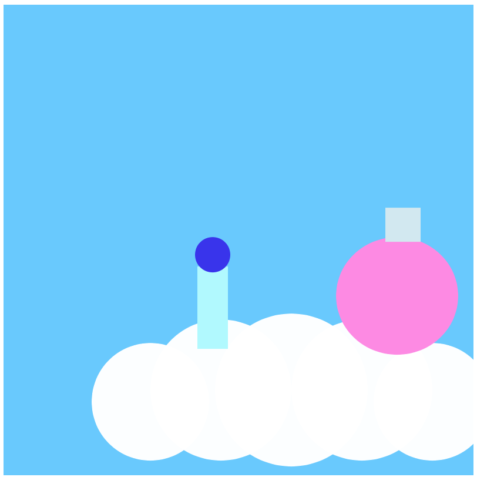
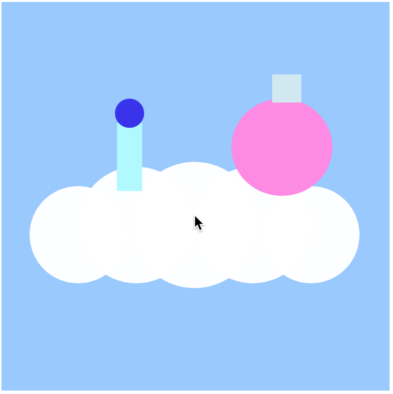
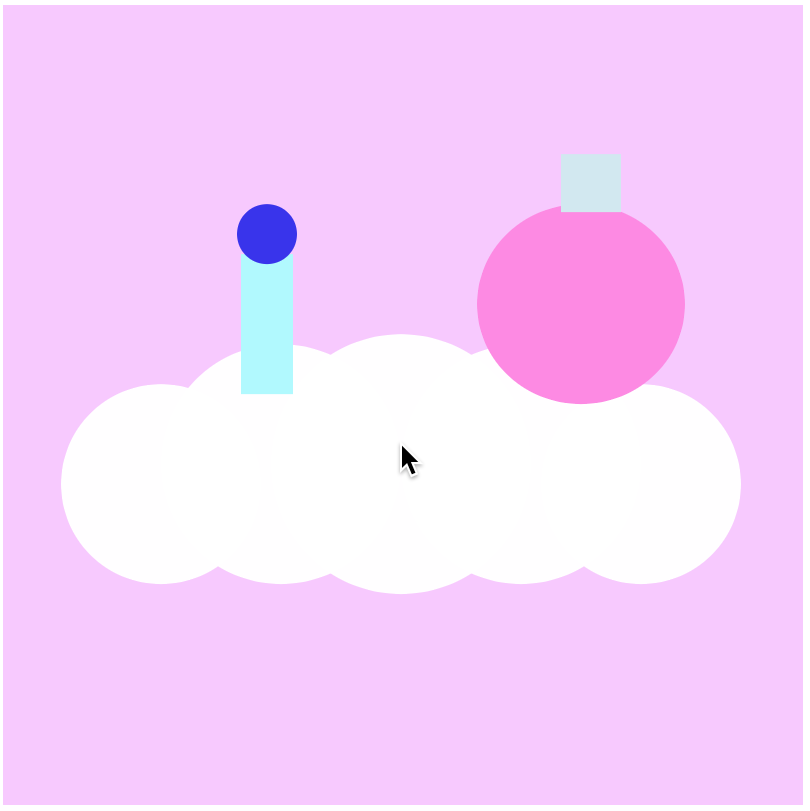

## Watch [Video 2.3 - Javascript Objects](https://www.youtube.com/watch?v=-e5h4IGKZRY)

# Watch [Video 2.5 - The random() Function](https://www.youtube.com/watch?v=nfmV2kuQKwA)

# Challenge 1: Add your name

**in `index.html`**

> [action]
> Find the `h1` tags in `index.html` and add your name so that it says `YOURNAME's...`
>

# Challenge 2: Declare and assign two creature objects

**in `sketch.js`**

> [action]
> Declare 2 vars called `rightCreature` and `leftCreature` at the top of the file.
>

<!--  -->

> [action]
> In `setup`, assign `rightCreature` and `leftCreature` to objects with the following 5 properties inside of them:
>
> - `color1`
> - `color2`
> - `height`
> - `width`
> - `xOffset`
>

<!--  -->

> [info]
> The `color` function doesn't work before the `setup` function, you will get an error if you try to declare and assign values to the objects all at the top.
>

<!--  -->

> [action]
> Give `rightCreature` a positive `xOffset` number and `leftCreature` a negative `xOffset`
>

# Challenge 3: Draw both creatures on the cloud

**in `sketch.js`**

It should look like your two creatures are staying in the same place on the cloud as you move the mouse around.

> [action]
> Use `mouseX` and `xOffset` so that `rightCreature` and `leftCreature` both follow the mouse but to the left/right side by a distance of `xOffset`
>

When drawing the creatures, be sure to:

- Use 2 or more shapes for each creature
- Use all 5 properties on each creature
- Make the creatures stay with the cloud in both the `x` and `y` directions.

## Example

> [solution]
> 
>

# Challenge 4: Click to change the sky color

**in `sketch.js`**

> [action]
> Add the `mousePressed` function at the bottom of the file  and add `print("clicked")` inside.
> Now you can see evidence in the console that your function was correctly called.
>

<!--  -->

> [info]
> Always double check that you are adding new functions in the correct location.
> If you accidentally create it inside of another function, then the program may not be able to correctly locate and use it and you may get an error.
>

<!--  -->

> [action]
> Inside of `mousePressed`, add a variable called `randomRed` and use `random` to assign a random number between 0 and 255.
>

<!--  -->

> [action]
> Inside of `mousePressed`, call the [`setRed` function](https://p5js.org/reference/#/p5.Color/setRed) on `skyColor` to change it's red amount to `randomRed`.
> (Note: don't use the exact example code, just use it as a guide)
>

## Example

The redness of the sky should now change color each time you click the mouse:

# Bonus 1: Explain the difference

> [challenge]
>
> 1. What is the difference between `value == 5` and `value = 5`?
> 1. Which one is used in conditional statements?
>

(Use `print()` inside of `setup` to answer.)

# Bonus 2: Make it a dance party!

> [challenge]
> Make your creatures dance back and forth when you click the mouse
>

**_Untz untz untz!_**
