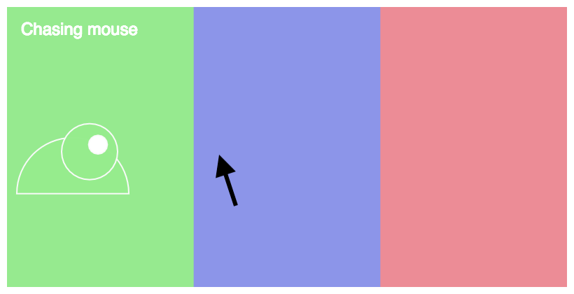
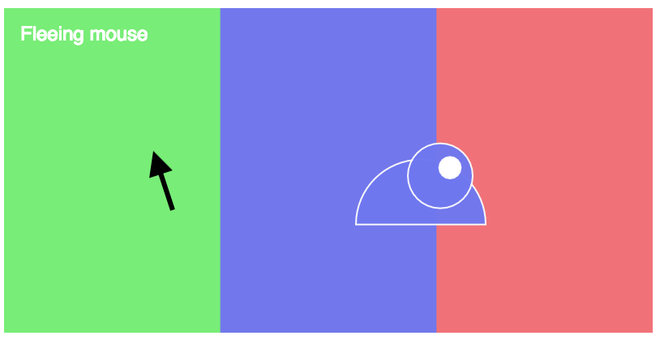
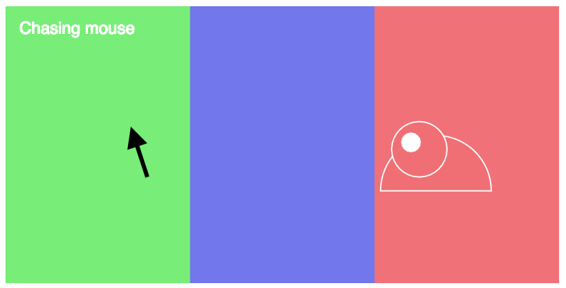
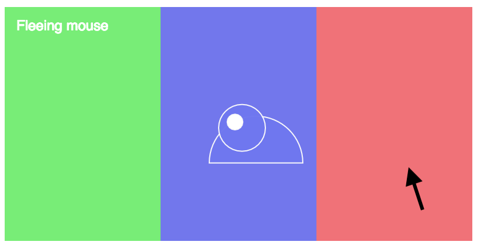

## Watch [Video 3.1 - Introduction to Conditional Statements](https://www.youtube.com/watch?v=1Osb_iGDdjk)

# Watch [Video 3.2 - The Bouncing Ball](https://www.youtube.com/watch?v=LO3Awjn_gyU)

# Watch [Video 3.3 - Else and Else if, AND and OR](https://www.youtube.com/watch?v=r2S7j54I68c)

# Watch [Video 3.4 - Boolean Variables](https://www.youtube.com/watch?v=Rk-_syQluvc)

# Challenge 1: Add your name

**in `index.html`**

> [action]
> Find the `h1` tags in `index.html` and add your name so that it says `YOURNAME's...`
>

# Challenge 2: Make the beast bounce horizontally

**in `sketch.js`**

Your `beast` should move right until it reaches the edge of the canvas, then change direction and move left until it reaches the edge of the canvas, then change direction again, etc.

> [action]
> First, modify `beast.x` in the `draw` loop to get the `beast` moving from left to right.
>

<!--  -->

> [action]
> Use an if statement to update `beast.speed` to create bouncing behavior

<!--  -->

> [challenge]
> Try to use only a single if statement, using `&&` and/or `||` as needed.
>

# Challenge 3: Create color-changing camouflage

**in `sketch.js`**

Dynamically change `beast.color` to match the color of the background as it moves.

> [action]
> Create an if statement to correctly update `beast.color`
>

`beast.color` should be `color1` while crossing the first third of the background, `color2` in the middle, and `color3` in the last third.

> [challenge]
> Format your logic so that colors update correctly even if the canvas is resized to be more or less wide.
>

# Challenge 4: Determine relative motion of the beast to the mouse

**in `sketch.js`**

To prepare for Challenge 5, you will need to find out when the `beast` is moving _towards_ the mouse and when it is moving _away_ from the mouse.

This can be done using two pieces of information:

1. Is the beast moving to the left or to the right?
1. Is the mouse to the left or the right of the mouse?

There are four possible combinations of these two pieces of information.

Beast moving right and mouse on right:

Beast moving right and mouse on left:

Beast moving left and mouse on left:

Beast moving left and mouse on right:

In two of the four combinations the beast is moving towards the mouse ("chasing") and in two the beast is not ("fleeing").

> [action]
> Create a boolean variable called `movingTowardsMouse`
>

`movingTowardsMouse` should be set to `true` when:

- `beast` is moving to the right **AND** the mouse is to the right of the `beast` **OR** `beast` is moving to the left **AND** the mouse is to the left of the `beast`
- **else** it should be set to `false`

> [action]
> Use an if statement to assign a boolean value to `movingTowardMouse`
>

Hint: you can tell which direction `beast` is moving based on it's speed!

# Challenge 5: Display if the beast is chasing or fleeing

**in `sketch.js`**

- If `movingTowardsMouse` is `true`, the message should say "Chasing"
- If `movingTowardsMouse` is `false`, the message should say "Fleeing"

> [action]
> Use an if statement to update `beast.message` to say whether it is chasing or fleeing the mouse
>

Review the images in Challenge 4 to see how the message should appear in each situation.

# Bonus 1: Add vertical movement to the beast

**in `sketch.js`**

> [challenge]
> Update your code so that `beast` bounces both vertically and horizontally across the canvas.
>

Ensure that `beast` still bounces horizontally across the entire width of the canvas.
