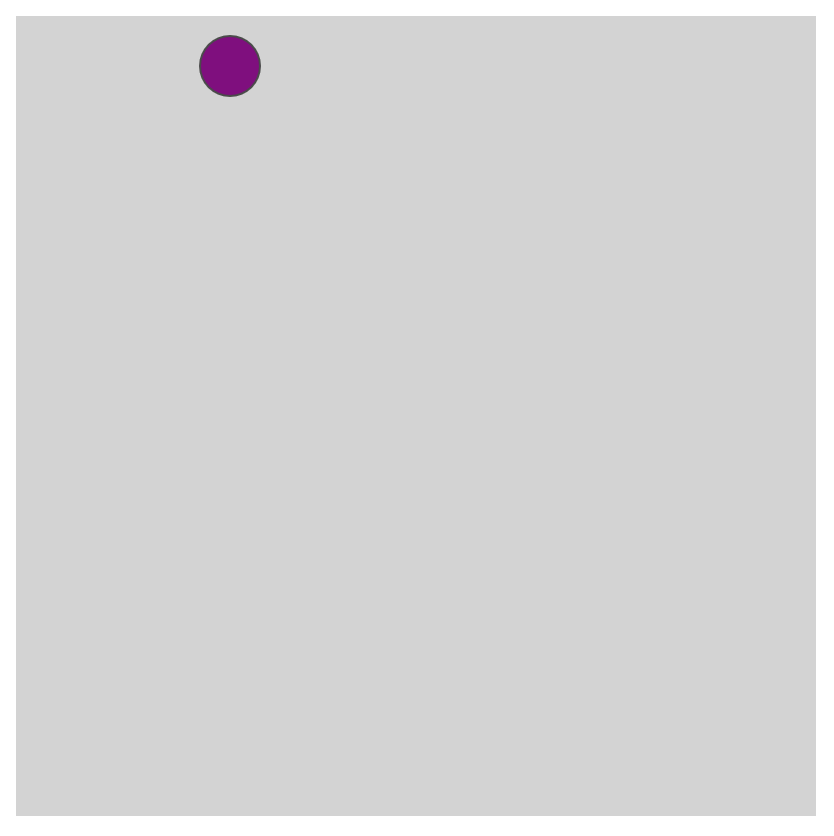
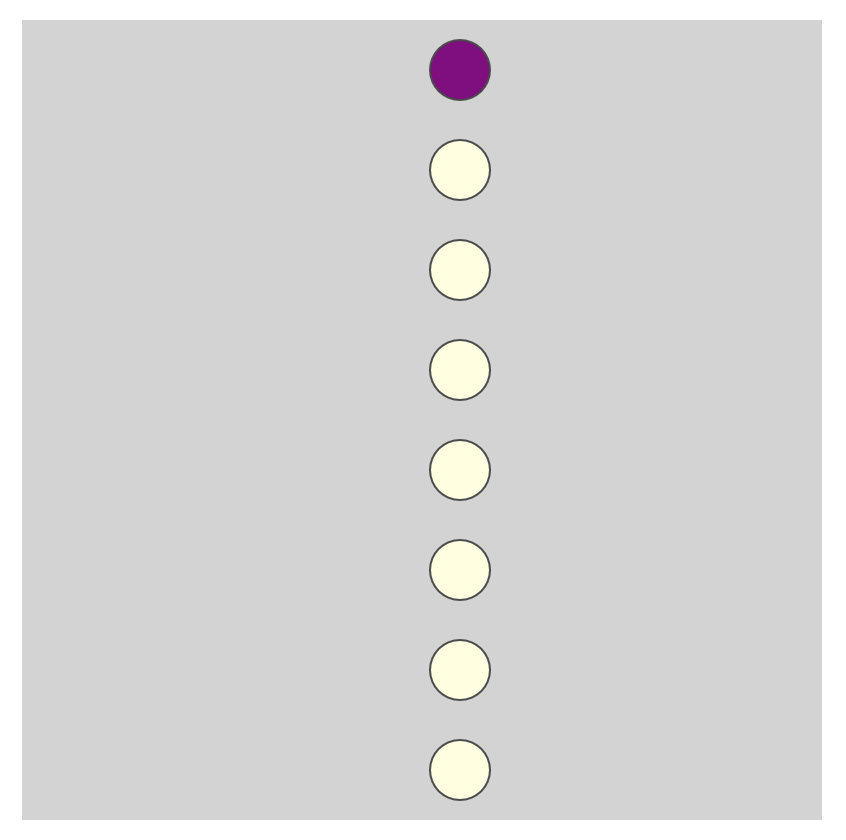
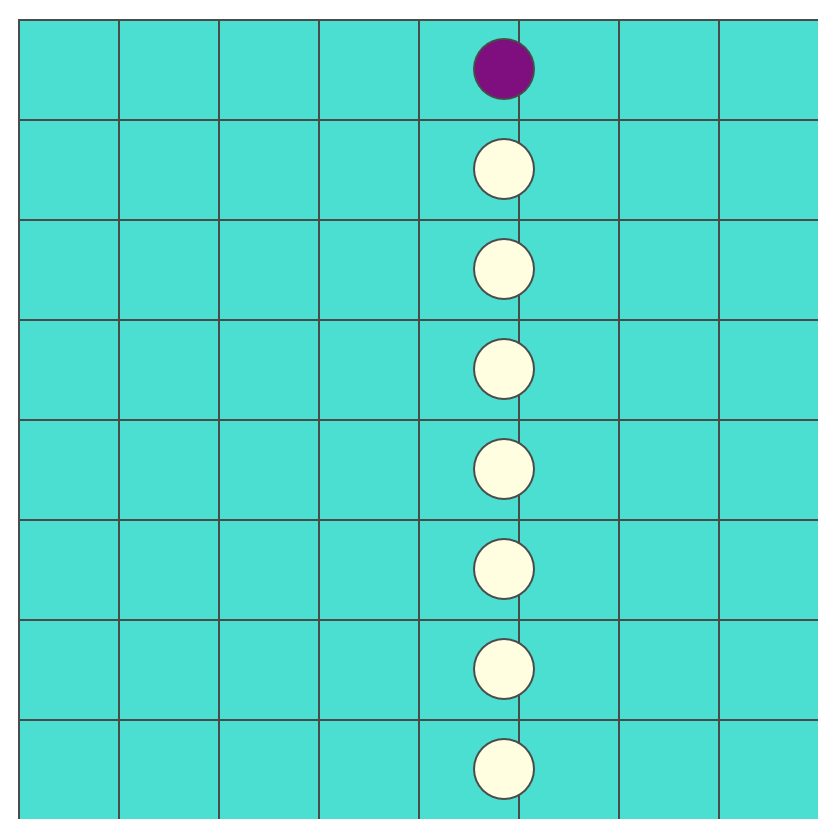
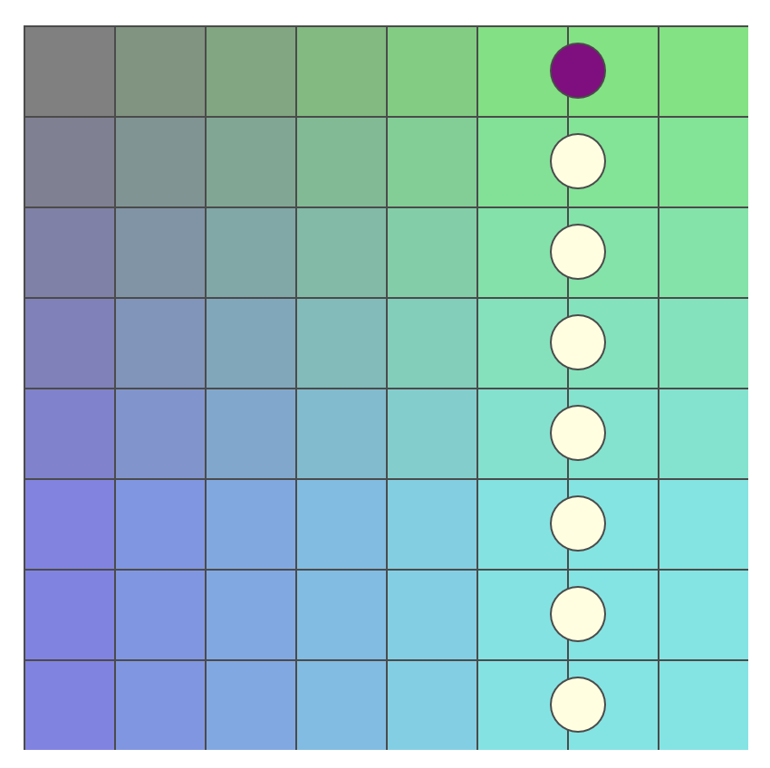

## Watch [Video 4.1 - While and For Loops](https://www.youtube.com/watch?v=cnRD9o6odjk)

Follow along with the [video guide](https://repl.it/@MakeSchoolRAMP/p5js-Video-Guide-41-while-and-for-Loops)

# Watch [Video 4.2 - Nested Loops](https://www.youtube.com/watch?v=1c1_TMdf8b8)

Follow along with the [video guide](https://repl.it/@MakeSchoolRAMP/p5js-Video-Guide-42-Nested-Loops)

# Challenge 1: Add your name

**in `index.html`**

> [action]
> Find the `h1` tags in `index.html` and add your name so that it says `YOURNAME's...`
>

# Challenge 2: Make the marcher march back and forth

**in `sketch.js`**

> [action]
> Use `marcher.speed` to update `marcher.x`
>

<!--  -->

> [action]
> Update `marcher.speed` so that `marcher` changes directions at the edges of the canvas
>

Marcher moving:

# Challenge 3: Draw clones of the marcher in a vertical row

**in `sketch.js`**

Use a `while` loop to create a squad of clones that will along with `marcher`.

> [action]
> Define a new var named `cloneY` for the loop to use, and assign it a starting value of `marcher.y` plus some spacing.
>

<!--  -->

> [action]
> In the `while` loop, draw clones that are spaced out until the end of the canvas. Make them a different color than the `marcher`.
>

Clones should all be evenly spaced and moving back and forth together:

# Challenge 4: Draw a tile floor

**in `sketch.js`**

> [action]
> Use a **nested** `for loop` to draw colored tiles across the whole screen.
>

Use the same size for spacing and drawing your tiles so that there are no gaps between tiles where the `backgroundColor` can show through:

# Bonus 1: Make gradient tile colors

**in `sketch.js`**

> [challenge]
> Give your tiles a gradient color effect.
>

Each tile should have a unique non-changing color different from the others around it.

