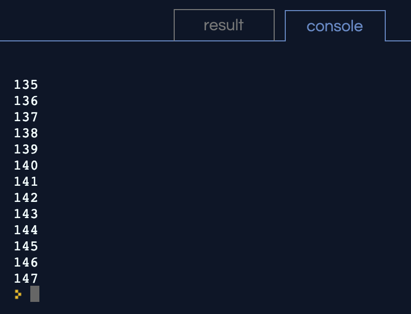
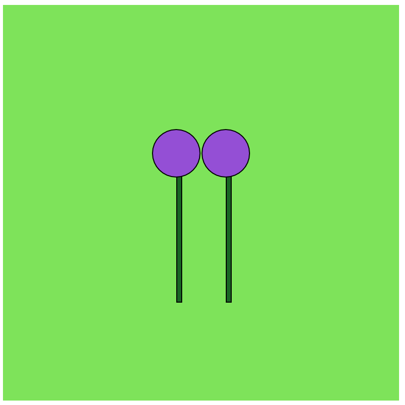
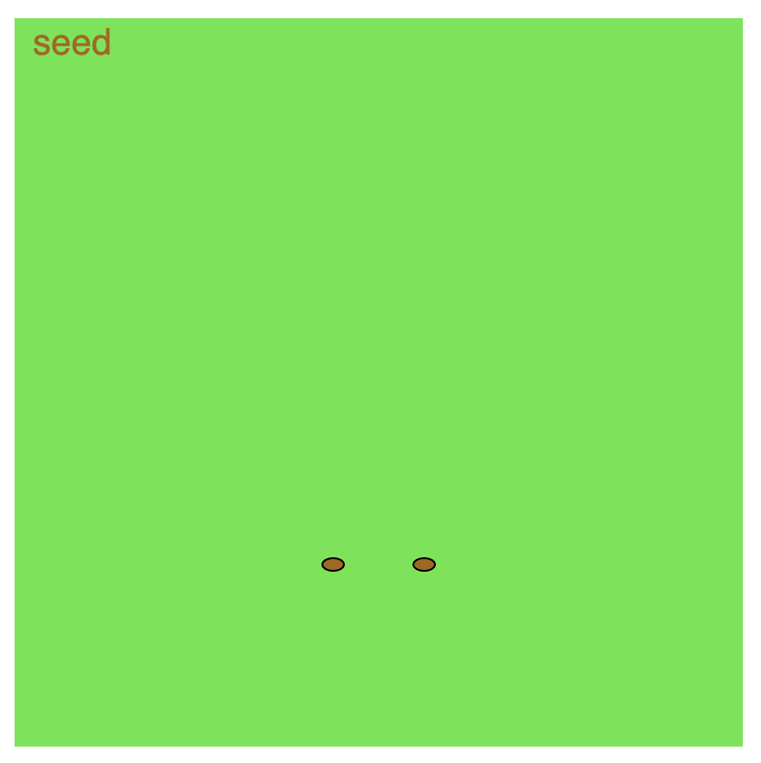
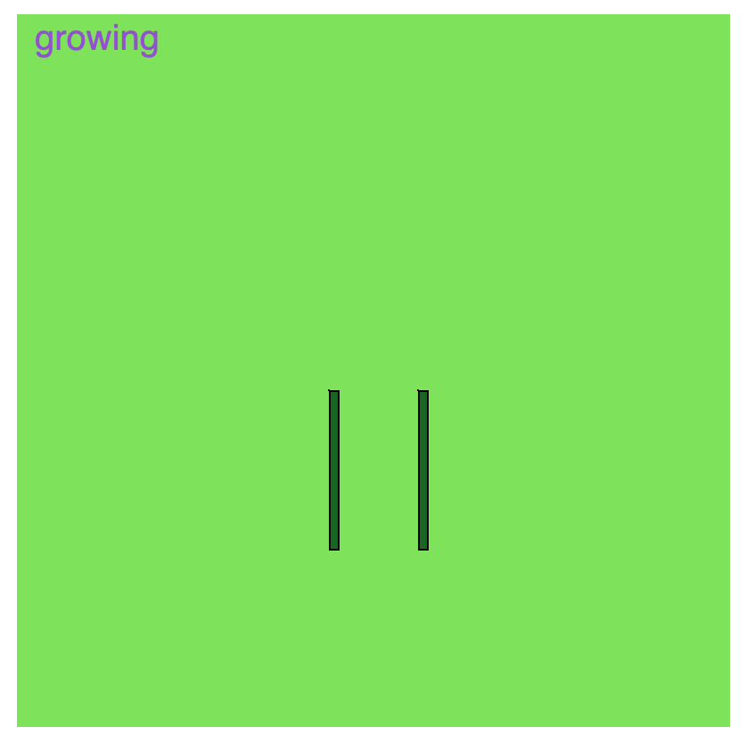
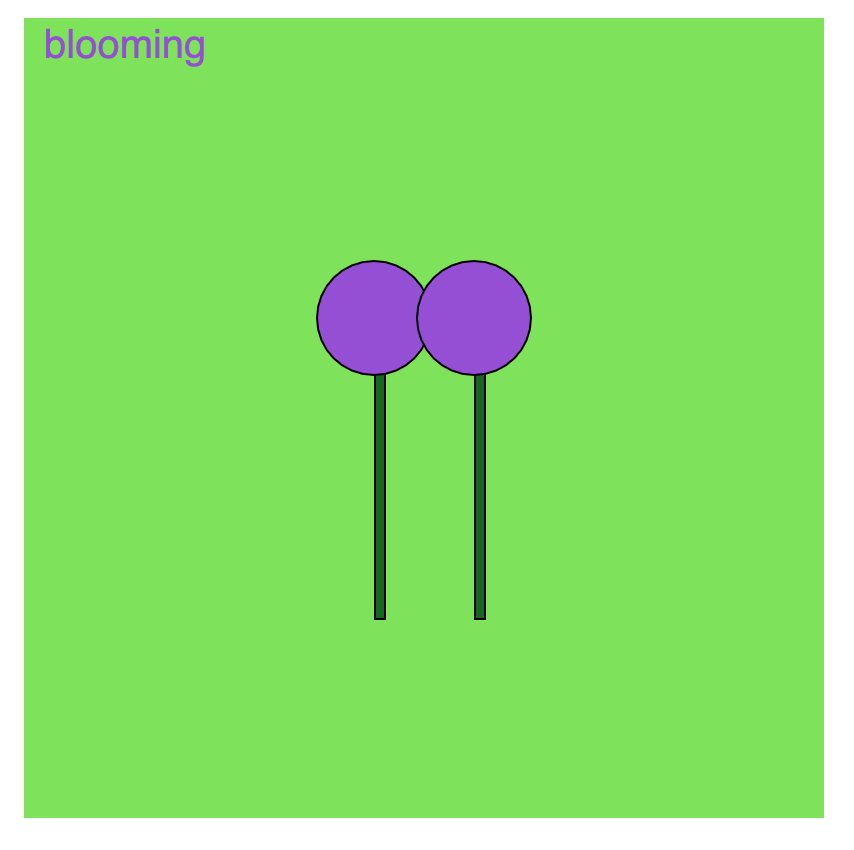
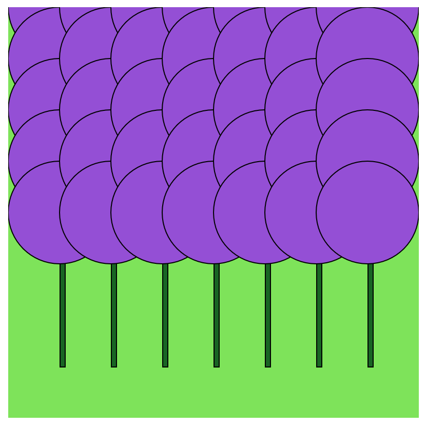

> [action]
> Access the assignment [0.6 Functions](https://repl.it/@MakeSchoolRAMP/06-Functions).
>

Remember to view the p5.js documentation as needed: [http://p5js.org/reference/](http://p5js.org/reference/).

## Watch [Video 5.1 Function Basics](https://www.youtube.com/watch?v=wRHAitGzBrg)

Follow along with the [video guide](https://repl.it/@MakeSchoolRAMP/p5js-Video-Guide-51-Function-Basics)

# Watch [Video 5.2 Function Parameters and Arguments](https://www.youtube.com/watch?v=zkc417YapfE)

Follow along with the [video guide](https://repl.it/@MakeSchoolRAMP/p5js-Video-Guide-52-Function-Parameters-and-Arguments)

# Watch [Video 5.3 Functions and Return](https://www.youtube.com/watch?v=qRnUBiTJ66Y)

Follow along with the [video guide](https://repl.it/@MakeSchoolRAMP/p5js-Video-Guide-53-Functions-and-Return)

# Challenge 1: Add your name

**in `index.html`**

> [action]
> Find the `h1` tags in `index.html` and add your name so that it says `YOURNAME's...`
>

# Challenge 2: Add grow or reset functionality

**in `sketch.js`**

The `growOrReset` function calls other functions depending on the situation.

> [action]
> The `growOrReset` function should call `plantGrow()` if the mouse is on the right half of the canvas, and should call `plantReset()` if the mouse is on the left side.
>

<!--  -->

> [action]
> Uncomment `growOrReset();` inside of `draw`
>

 You can check in the console to see if `plant.size` is changing correctly:

# Challenge 3: Display the plants

**in `sketch.js`**

The `drawPlant` function needs to pass down it's `x` and `y` parameters to the other functions it calls.

> [action]
> Inside of `drawPlant`, if `plant.size` is 0, call `drawSeed`, otherwise call both `drawSprout` and `drawBloom`. Don't forget to pass the required parameters!
>

<!--  -->

> [action]
> Uncomment the two lines calling `drawPlant()` inside of `draw` .
>

Watch the two plants grow and bloom:

# Challenge 4: Implement the label function

**in `sketch.js`**

The `plantLabel` function needs to `return` a string label.

> [action]
> Based on `plant`'s current properties, return the correct string: `"seed"`, `"growing"`, or `"blooming"`
>

<!--  -->

> [action]
> Uncomment `text(plantLabel(), 10, 20);` inside of `draw`
>

 You should now see correct labels in the upper left corner:

# Bonus 1: Display a field of plants

**in `sketch.js`**

> [challenge]
> Display a whole field of plants instead of just two.
>

