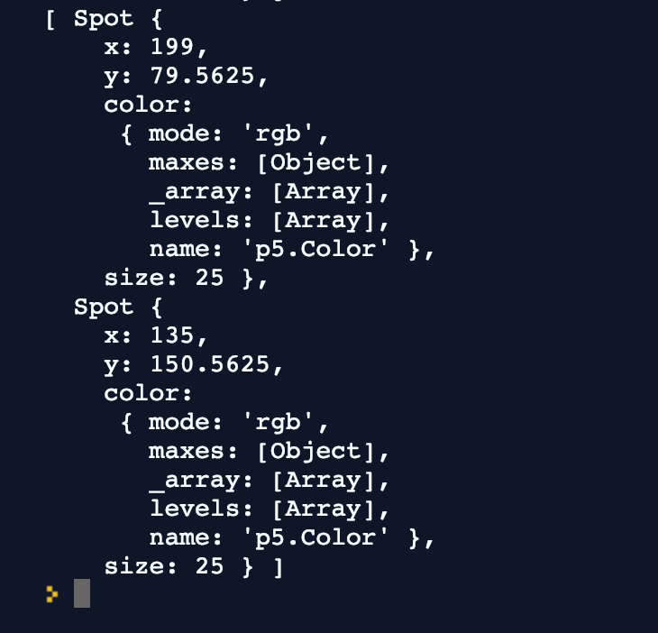
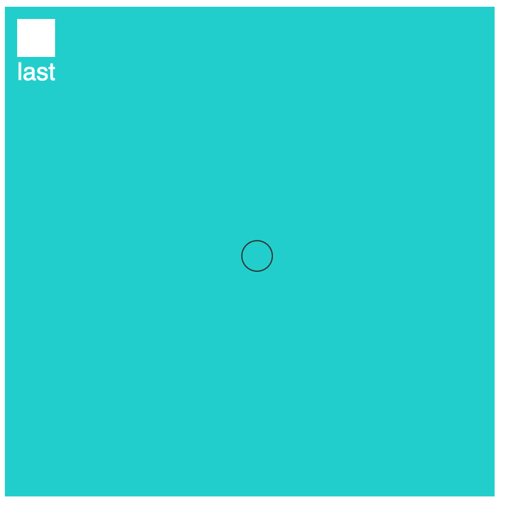
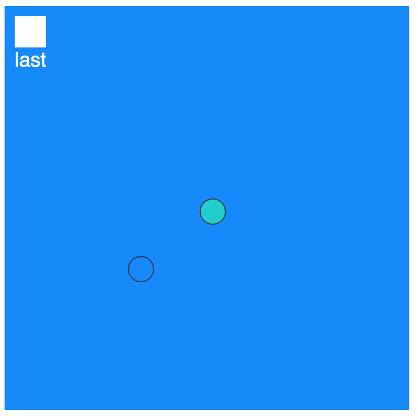
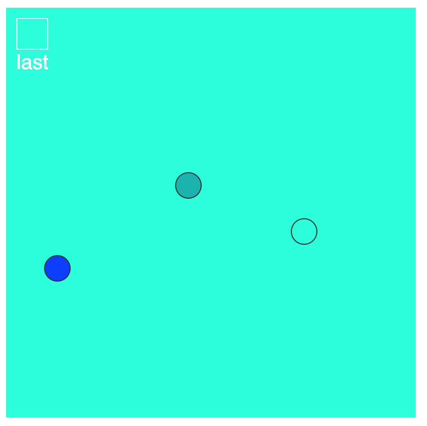

## Watch [Video 7.1 What is an array?](https://www.youtube.com/watch?v=VIQoUghHSxU)

# Watch [Video 7.2 Arrays and Loops](https://www.youtube.com/watch?v=RXWO3mFuW-I)

# Watch [Video 7.3 Arrays of Objects](https://www.youtube.com/watch?v=fBqaA7zRO58)

# Challenge 1: Add your name

**in `index.html`**

> [action]
> Find the `h1` tags in `index.html` and add your name so that it says `YOURNAME's...`
>

# Challenge 2: Save new spots

**in `sketch.js`**

The `mousePressed` function calls `saveSpot` but nothing happens yet. The goal is to save a spot that has the color that the canvas is when the mouse is clicked.

> [action]
> Inside of `saveSpot`, create a `new Spot` using the current mouse location and `currentColor()`.
>

You can add the new spot to the `spots` array using either the `push` or `append` functions.

Click a few times and then check the results of `print(spots)` in the console to see if new `Spot` objects are being added:

# Challenge 3: Draw the spots

**in `sketch.js`**

Now you are saving spots, but not using them. For now we just want to display each one on the canvas.

> [action]
> Use a `for loop` to get each spot in `spots` and then call the `show` function on it.
>

Each time you click and then move your mouse you should see a new colored spot where you just clicked:

# Challenge 4: Get the last color

**in `sketch.js`**

Right now the `lastColor` function is just returning a default value of white, that is being used to color the box in the upper left corner.

> [action]
> Update `lastColor` so that it returns the color of the most recently added spot. Return the default white when there are no spots yet.
>

There are a few steps that you can break this challenge into:

- check if there are any spots yet, if not, return white
- if there are spots, get the index of the last location in the array
- use the index to get the last spot
- update `lastColor` to be the value of the color property of the last spot

When your logic is working correctly, the upper left square should correctly match the color of the most recently added spot:

# Bonus 1: Add functionality

**in `sketch.js`**

> [challenge]
> Use 1 or more new array functions from [https://p5js.org/reference/](https://p5js.org/reference/) to add new effects to your program.
>
