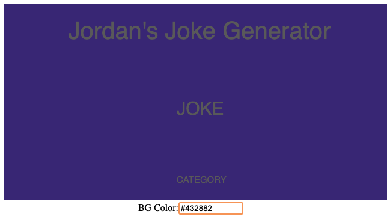
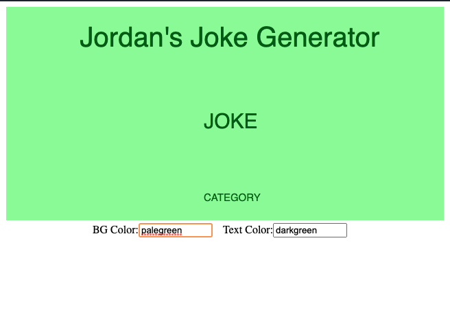
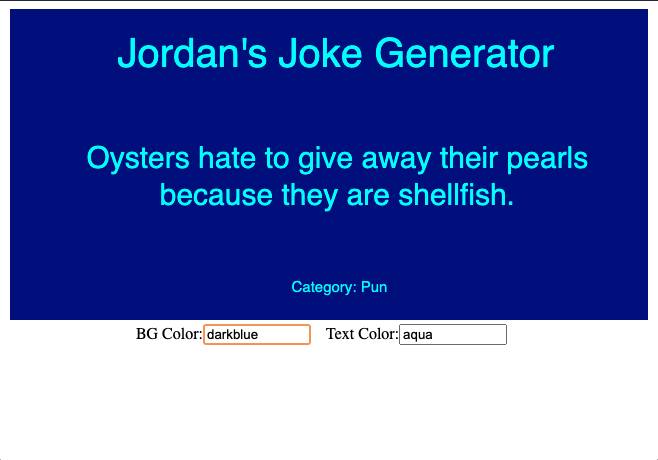
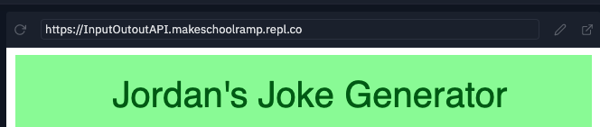
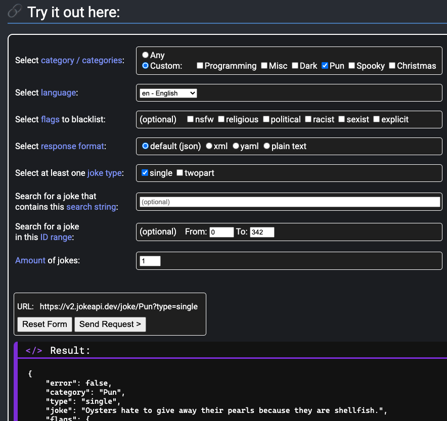
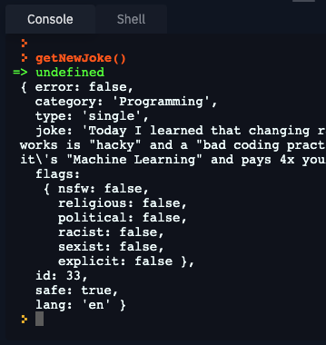
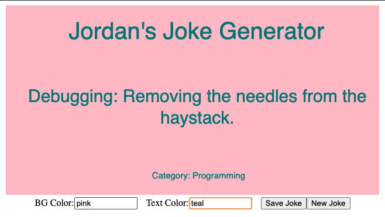

> [action]
> Access the assignment [0.9 Input, Output, and APIs](https://repl.it/@MakeSchoolRAMP/09-Input-Output-APIs).
>

Remember to view the p5.js documentation as needed: [http://p5js.org/reference/](http://p5js.org/reference/).

## Watch [Video 8.2 Creating HTML Elements with JavaScript](https://www.youtube.com/watch?v=lAtoaRz78I4)

## Watch [Video 8.4  Handling DOM Events with Callbacks](https://www.youtube.com/watch?v=NcCEzzd9BGE)

## Watch [Video 8.5 Interacting with the DOM using Sliders, Buttons and Text Inputs](https://www.youtube.com/watch?v=587qclhguQg)

# Challenge 1: Add your name

**in `sketch.js`**

> [action]
> Modify the `displayTitle` function in `sketch.js` and add your name so that it says `YOURNAME's Joke Generator
>

# Challenge 2: Allow user to input colors

**in `sketch.js`**

The `assignColors` function currently assigns `backgroundColor` and `textColor` to default starting values. The goal is to allow the user to type in color names or hex codes to assign colors to the background and text so we’ll need to add input fields for the user to type their preferred colors. 

A helper function is already setup to create the first input - look through the starter code to find the function that you’ll need to call during setup.

> [action]
> 2A Inside of `setup`, call the helper function that will add the color input elements to the page.
>

Once you re-run you should see the new text and input added below the canvas. You can type in it but the value is not being used. To access the value of the user’s input, you can reference it using dot notation `value()`.

> [action]
> 2B In the `assignColors` function, modify the first line so that the background color is set to `inputBGColor.value()`.
>

Now you should see that the background color will change to match the color name or hex value that you type. Don’t forget to include the `#` at the start of your hex codes.

HINT: Right now, if there’s no user input for the color it will default to white. Can you think of how to give it your own custom color when there isn’t any user input yet?

Once you have things working for the background color, use it as your example and add another input for the user to enter a text color.

> [action]
> 2C Uncomment the global variable `inputTextColor`, then use it to modify `createColorInputs()` to add another text and input element, finally update `assignColors()` to assign `textColor` to the new input value.
>

Confirm that you can now change both colors using the inputs:

HINT: Remember, it will default to white when there isn’t any user input at the start of the program. You can use || (or) to give a backup value to variables when the first option might be empty or null: `var exampleVariable = checkForValue() || “defaultValue”`.

# Challenge 3: Display and save jokes

**in `sketch.js`**

Now that the page looks nice, let’s get to the jokes. Soon we’ll implement calling the Jokes API for random jokes, but first we’ll add a sample joke for the page to load with. 

> [action]
> 3A Uncomment the global variable `jokeInfo`, then assign it in the `setup` function to an object with two properties `category` and `joke`. 
>

You can use your own starting joke values, or this one from the “Pun” category - "Oysters hate to give away their pearls because they are shellfish." xD

> [action]
> 3B Find the two uses of the `text` function insides of `displayJoke()` and change it to use the new values on the  `jokeInfo` object. 
>

Check that your page is now Laugh-Out-Loud hilarious...

It’s looking so good, let’s give the user the ability to save the joke! Check out the `save` function in the p5.js reference.

> [action]
> 3C Find the helper function that creates the “Save Joke” button and call it in `setup`. Then find the function called `saveJoke` and implement the p5.js `save` function to save the current canvas as a JPG.
>

NOTE: This function only works when website opened in another tab, not inside of the replit editor. Naviate to the public url located in the top of the output window:

# Challenge 4: Call the Jokes API to generate new jokes on demand

**in `sketch.js`**

The sample joke is of course toooootally hilarious, but just in case the user has a different sense of humor, let’s connect our page up to JokeAPI for more joke diversity.

> [action]
> 4A Uncomment global variable `jokeURL` and assign a valid value to it in `setup()`.
>

What's a valid URL?

> [info]
> To get a valid URL, visit [https://v2.jokeapi.dev/#try-it](https://v2.jokeapi.dev/#try-it)
> Use “default (json)” as the format
> Check “single” for joke type (handling “twopart” jokes is a stretch challenge!)
> Only get 1 joke at a time
>

Next we will use the `httpGet` function to call the API at the URL and get our joke response. The response is in JSON format, and you can see that it also has `joke` and `category` properties (in addition to others we aren’t using), so we’ll be able to save it directly to the `jokeInfo` object and the `displayJoke` function will work correctly.

> [action]
> 4B Find the `getNewJoke` function. Inside of the `httpGet` code block, add code between the { and } to set `jokeInfo` equal to `response`. Then add a `print(response)` so that you can see the full return value in the console.
>

Re-run your program - you’ll see your starter joke still. Test your new function by calling it in the console and checking that it prints out the return value from calling the JokeAPI:

As the final final step we need 1 more button so that the user can click it to call the API for a new joke.

> [action]
> 4C Modify the `createButtons` function to add a second button for calling the JokeAPI.
>

Enjoy generating and saving your favorite jokes!

# Bonus 1: Explore other user inputs for colors

**in `sketch.js`**

> [challenge]
> Use 1 or more other ways to collect user input for the color values. (Example: Check out [ColorPickers](https://p5js.org/reference/#/p5/createColorPicker) ).
>

# Bonus 2: Explore more interactions with users and the JokeAPI

**in `sketch.js`**

> [challenge]
> Example: Update ‘displayJoke’ to handle “twopart” jokes.
> Example: Allow the user to select which category of jokes they want to generate.
>
